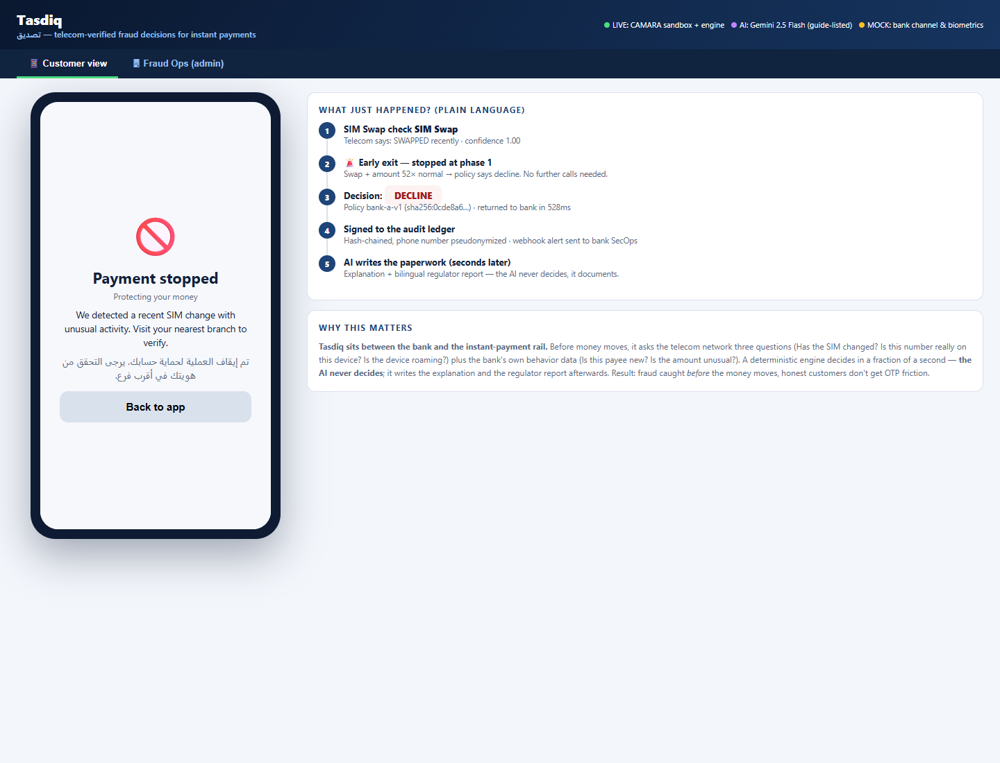
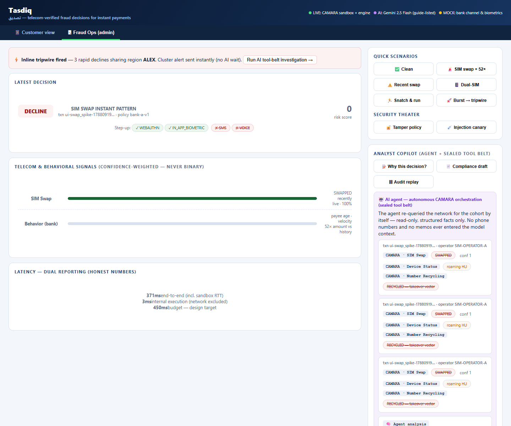

# Tasdiq تصديق — Telecom-Verified AI Risk Agent for MENA Instant Payments

**MENA Ignite Hackathon 2026 · Theme 4: Secure FinTech, Payments & Anti-Fraud · Team: Omar Chehade & Mohamad Nour Sayour**

Tasdiq (Arabic for *verification*) stops account-takeover fraud on instant payment rails
(InstaPay · Sarie · Aani · FAST) **before the money moves** — using GSMA Open Gateway
**CAMARA APIs** (SIM Swap, Number Verification, Device Status, Device Swap) via the **Nokia Network-as-Code** platform as confidence-weighted signals
inside a **deterministic decision engine**, with an async **AI agent layer** (guide-listed
model) for bilingual compliance drafting and investigations.

> **5G-ready:** the 450ms decision budget is a service-level target independent of the
access network — 5G URLLC radio/core transport adds single-digit milliseconds, and the
engine's internal execution is single-digit ms. Faster networks shrink headroom concerns,
never the architecture.

> **Core principle — deterministic security, generative compliance:**
> the engine decides every transaction inline (450ms budget: two 200ms signal phases +
> 50ms margin); the AI never decides — it explains, investigates, and drafts paperwork.

  

---

## How it works (60 seconds)

1. Bank calls `POST /v1/decide` with the transaction (amount, payee age, velocity).
2. **Phase 1 (0–200ms):** SIM Swap check alone. Fresh swap + amount > multiplier×mean
   (per-bank, e.g. 40×) → **DECLINE immediately** (early exit).
3. **Phase 2 (200–400ms):** Number Verification + Device Status + Device Swap **in parallel**, plus
   bank-side behavioral signals (payee recency, velocity, amount-vs-mean) — catches
   snatch-&-run theft where telecom signals stay green.
4. Confidence-weighted scoring: `risk = Σ(riskᵢ × confᵢ) ÷ Σ confᵢ + behavioral points`,
   six hard rules, per-bank signed policy → **APPROVE / ESCALATE / DECLINE** with
   **band isolation** (after a SIM swap, SMS/voice step-up is *prohibited* — the OTP
   would reach the attacker's SIM; in-app biometrics/WebAuthn only).
5. Decision returns to the bank (dual latency: end-to-end + internal) and is appended
   to a **hash-chained, pseudonymized, RFC 3161-anchored audit ledger**.
6. **Seconds later (async):** the AI agent writes the decision explanation and the
   bilingual (MSA/English) regulator-report draft; when the deterministic tripwire
   detects a coordinated attack, the agent **orchestrates CAMARA re-queries itself**
   through a PII-sealed, read-only, ledger-logged tool belt.

## Architecture

| Layer | Responsibility |
|---|---|
| **L0** | Conditional silent authentication (Number Verification match + stable SIM → OTP-free) |
| **L1** | CAMARA signal collection via Nokia NaC — per-operator circuit breakers, labeled cached fallback, deadline budgeter |
| **L2/L2.5** | Progressive engine: early exit, parallel phase, confidence weighting, behavioral signals |
| **L3** | Ed25519-signed maker-checker policies; every decision binds its policy hash (tampered config → rejected) |
| **L4** | Async AI agent: explanations, bilingual reports, clustering, copilot, injection canary + inline tripwire |
| **L5** | Dual-ledger audit: Intercept (inline) + Agent (async), HMAC-pseudonymized MSISDNs, RFC 3161 anchor queue |

```
bank ──► /v1/decide ──► [L1 CAMARA: SIM-Swap ▸ Number-Verify ▸ Device-Status ▸ Device-Swap]
                         │  (Nokia NaC gateway, per-operator breakers)
                         ▼
              [L2 engine: rules 0–5 + confidence math] ──► decision + band + step-up
                         │                                      │
              [L5 Intercept Ledger]                   [L4 async AI agent]
              hash-chained · pseudonymized            tool belt → CAMARA re-queries
              RFC 3161 anchor queue                   bilingual reports · copilot
```

## Quickstart

> **Requires Python 3.10+** (the codebase uses PEP 604 type unions).

```bash
pip install -r requirements.txt
cp .env.example .env            # add your keys (see below)
python -m pytest tests/ -q      # 21 tests — engine rules, tamper rejection, canary, proportionality policy
python demo/run_demo.py         # live end-to-end evidence run → evidence/
python ablation/run.py          # 200-case ablation study
python -m uvicorn app.main:app --port 8793   # first boot auto-generates Ed25519 keys
                                             # and signs the demo policies — no manual setup
# → demo UI: http://127.0.0.1:8793/   (customer view + fraud-ops dashboard)
```

**`.env` keys (gitignored — never commit):** `NAC_API_KEY`, `NAC_BASE_URL`,
`GEMINI_API_KEY`, `GEMINI_MODEL`. NaC self-registration is free at
[networkascode.nokia.io](https://networkascode.nokia.io) (simulator numbers included).
The AI layer is model-agnostic: any Resource & Tooling Guide-listed model (default
demo: Gemini 2.5 Flash; alternatives: Groq Llama 3.3, self-hosted Ollama/vLLM for
sovereign deployments — hosted models see **synthetic demo data only**).

## API

| Endpoint | Purpose |
|---|---|
| `POST /v1/decide` | The decision rail (decision, band, step-up allow/prohibit, dual latency, policy hash) |
| `POST /v1/replay` | Audit replay of any transaction from the ledger |
| `GET /v1/metrics` | Engine metrics |
| `GET /docs` | Machine-readable OpenAPI spec — banks can generate client SDKs from it (locked inter-service contracts are a Phase-1 workstream) |
| `POST /v1/policy/verify` | Policy-bundle signature verification (tamper demo) |
| `POST /v1/agent/explain` · `/report` · `/customer_alert` | Async AI outputs (schema-locked JSON) |
| `POST /v1/agent/investigate` | **Agent-orchestrated CAMARA re-queries** for a tripwire cluster (sealed tool belt) |
| `POST /v1/agent/copilot` | Analyst Q&A from ledger projection only (no PII) |
| `POST /v1/agent/canary` | Prompt-injection containment proof |

> **Deployment topology:** the prototype serves `/docs` openly for evaluation. Production
deployment requires these endpoints behind an enterprise API gateway (Kong/Apigee-class)
enforcing mutual TLS, bank↔Tasdiq IP allow-listing, payload signature verification, and
rate limiting on audit endpoints (`/v1/replay` is I/O-heavy — gateway-level rate limits
protect the inline rail's worker threads). For low-latency guarantees the production
instance collocates at the operator edge or terminates a dedicated UPF data path into
the regional operator core — public-internet BGP routing would waste the 5G URLLC budget.


## Why each CAMARA API earns its place

| API | The question it answers | Fail-safe hardening when the signal is unavailable |
|---|---|---|
| **SIM Swap** | Did this number move to a new SIM? | Rule-0 early exit never fires; the case still routes through Phase 2 + behavioral scoring — but you lose the instant decline and the SMS-prohibition UX |
| **Device Swap** | Did the number move to a different *device*? | Catches the simultaneous-swap attack: SIM *and* device changed >24h apart — by payment time SIM Swap reads "old" (outside its window) and only Device Swap still flags the change |
| **Number Verification** | Does the number match the paying device? | Silent possession check unavailable — every payment falls back to OTP step-up |
| **Device Status** | Roaming / country / connectivity? | Context loss: a roaming regular traveler scores closer to a takeover case |

A missing signal is not an opening — it's a tightening. Confidence drops to 0, the
coverage/primary-loss rules escalate, step-up collapses to biometric-only, and
high-value instant clearance locks until signals return. Attackers who force a
degraded state force a stricter bank, not a blinder one. Behavioral floor: ≥2 transactions for the same account within one hour forces
a full sweep — no skips allowed (attack windows look like busy accounts). In
the async lane the agent may skip a probe only when independent corroboration
makes it mathematically redundant (e.g. Device Swap already confirmed in a
prior pass + inline SIM Swap ≥ 0.9); the inline rail always calls all 4 —
skips happen only after the bank has its decision.

`known_facts` are populated only from CAMARA API responses recorded in prior
probes (Agent Ledger) — never from LLM-generated text. The agent cannot
self-populate its skip logic through its own prose.

Together with bank-side behavioral signals (payee recency, velocity, amount-vs-mean), the
four families cover number theft, device re-registration, phone-in-hand theft, and
coercion-style anomalies — no single signal covers them all.

Number Recycling (bonus, tool-belt-only) is Nokia NaC's own number-recycling
endpoint — separate from the 4 inline CAMARA APIs.

## Demo UI (two views)

## Proof the AI works (live capture)

The async agent doesn't just "use AI" as a label — the repo contains captured
evidence of it orchestrating network APIs by itself:

- **Agent-decision lines** — each investigation card opens with the policy's
  decision in plain language: *"first forensic pass — full sweep"* on the first
  pass, then *"device re-registration already confirmed in prior pass; recycling
  status already on record (ran 2/4)"* when re-running is mathematically redundant.
- **Per-API result chips** — every CAMARA call the agent makes is shown with its
  live answer: SIM Swap `SWAPPED` · Device Status `roaming HU` · Device Swap
  `NEW DEVICE` · Number Recycling `RECYCLED — takeover vector`.
- **Raw captures:** `evidence/live_calls/four_signal_live_decision.json` (all four
  signals live through the pipeline) and `evidence/portal/ui_policy_pass2_selective.png`.

| 📱 Customer | 🖥 Fraud Ops |
|---|---|
| Phone mockup ("Nile Bank — InstaPay"), 5 scenario chips, bilingual AR/EN results, Face-ID step-up ("no SMS was ever sent") | Decision badge + band, confidence bars, step-up chips (SMS ✗ crossed on swap bands), dual latency, tripwire → **AI panel showing each of the agent's 4 CAMARA calls**, tamper + canary buttons, audit chain |

### Screenshots (live demo)

| Customer view — attack stopped | Fraud Ops — agent orchestrating CAMARA |
|---|---|
|  |  |

Scenarios: normal payment · **SIM-swap attack** (early-exit decline) · recent swap
(sensible weighting) · dual-SIM user (downweight, no false alarm) · **snatch-&-run**
(behavioral detection, biometric-only step-up).

## Results (labeled honestly)

- **Ablation — seeded, feature-varied synthetic cases in three splits** (`ablation/run.py`):

  | Split | n | Bank-only | Telecom-only | Blend | Incremental |
  |---|---|---|---|---|---|
  | Tune (seed 2026) | 150 | 0.50 | 0.50 | **1.00** | **+0.50** |
  | **Held-out** (seed 777, never used for rule work) | 50 | 0.49 | 0.51 | **1.00** | **+0.51** |
  | Boundary hard set (exact-threshold cases) | 8 | 0.50 | 0.25 | **0.75** | +0.25 |

  Zero false positives everywhere. The two signal families are complementary — each
  alone catches ~half; blended, they catch everything the generator can express.
  The **boundary set deliberately probes our weak spots** (amounts at exactly 20×,
  attempts at exactly 5, SIM-swap confidence at exactly 0.9): we publish the 2 misses
  (sub-threshold amounts with a clean SIM) instead of hiding them. *Earlier, scaling
  30 copied cases → varied cases caught a real engine bug: rule 0 fired only at
  confidence exactly 1.0, so cached-fallback swap detections (0.9) escaped the
  band — fixed to ≥ 0.9.*
- **Latency — measured, dual-reported** (16 live runs, `evidence/latency_measurements.json`):

  | Metric | End-to-end (incl. sandbox RTT) | Internal execution |
  |---|---|---|
  | p50 | **334 ms** | **3 ms** |
  | p95 | 525 ms | 35 ms |

  Budget met on **94%** of live runs *through the shared dev sandbox*; the two Phase-2
  network calls run in parallel threads. The sandbox is shared dev infrastructure —
  we show its overhead, not hide it. Production banks call NaC from their own VPC
  (sub-50 ms RTT).
- **Tests:** 21/21 — rule ordering, early exit, Ed25519 tamper rejection, injection,
  canary, breaker behavior, ledger chains, pseudonymization.
- **Evidence:** `evidence/live_calls/` (first live CAMARA call), `evidence/demo_run/`
  (full live run), `evidence/ablation_results.json`, `evidence/portal/` (UI
  screenshots + official-rules verification).

## Threat model → controls (all demoed live)

| Threat | Control |
|---|---|
| Insider tampers with bank policy thresholds | Ed25519 maker-checker signatures — tampered bundle rejected (live demo) |
| SMS/call reaches the attacker during takeover | Band isolation — SMS/voice prohibited on swap & behavioral bands |
| Attacker floods accounts to trick the agent into skipping probes | Behavioral floor — account pressure disables skips, full sweep forced |
| Hostile text poisons AI reports | PII-sealed tool belt + schema-locked outputs + structural injection canary (live demo) |
| Decision history rewritten | Hash-chained dual ledgers + RFC 3161 anchoring + pseudonymized MSISDNs |
| NaC/carrier outage masks an attack | Confidence → 0, coverage & primary-loss rules escalate; signed degraded-mode fallback |
| Replay of captured decisions | Policy-hash binding per decision; mTLS + nonce (production deployment) |
| Public endpoint abuse | Env-gated gateway-signature enforcement + topology note (gateway, mTLS, allowlist, rate limits in prod) |

## Security mechanisms (detail)

- **Ed25519 signed maker-checker policies** — tampered config rejected, never silently honored
- **Band isolation** — SMS/voice step-up *prohibited* on SIM-swap and behavioral bands
- **PII-sealed tool belt** — agent tools take opaque IDs; phone numbers never enter model context
- **Schema-locked outputs + structural canary** — hostile memos cannot poison reports
- **Dual-ledger audit** — HMAC-pseudonymized MSISDNs, RFC 3161 anchoring, decision replay
- **Fail-safe resilience** — per-operator breakers; primary-signal loss + anomaly → escalate;
  signed degraded-mode fallback if the platform is unreachable (attackers buy a stricter posture)

## Honest scope

Mocks (labeled in-demo): biometric UI, InstaPay end-to-end flow (simulated), Sarie/Aani/FAST
(config labels), synthetic transaction history. Phase 1 workstreams (named, not assumed):
porting-aware MNP cache (static map in prototype), operator consent/data-sharing agreements,
bank pilot. Reports are drafts for human compliance review. We claim "regulator-aligned",
never "certified".

## Repo map

```
app/main.py            FastAPI service + endpoints          app/policy.py      Ed25519 maker-checker
app/engine/decide.py   pipeline (phases, dual latency)      app/ledger.py      dual ledger + anchors
app/engine/weighting.py rules 0–5 + confidence math        app/tripwire.py    cluster alarm
app/signals/nac.py     NaC client + breakers + fallback     app/ai/agent.py    Gemini agent (schema-locked)
demo/ui/index.html     two-view demo UI                     app/ai/tools.py    sealed tool belt
demo/run_demo.py       live evidence run                    ablation/run.py    200-case study
demo/DEMO_SCRIPT.md    ≤3-min video script + judge Q&A      HANDOFF.md         full continuation doc
```

## Team

Omar Chehade · Mohamad Nour Sayour — Computer & Electrical Engineering, Beirut Arab
University. Built during the hackathon window (Jul 1 – Sep 13, 2026), AI-assisted with
approved tooling. Code is original team IP per hackathon rules.
